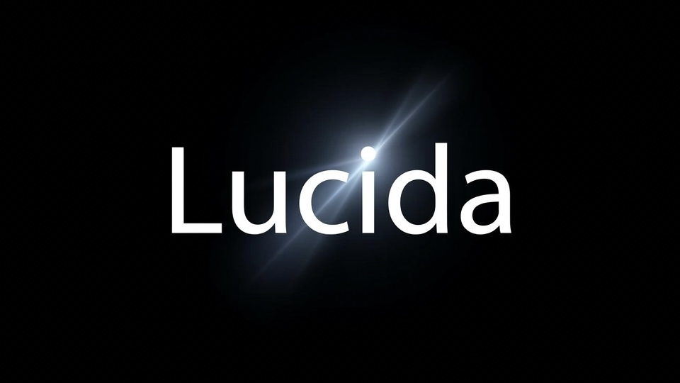
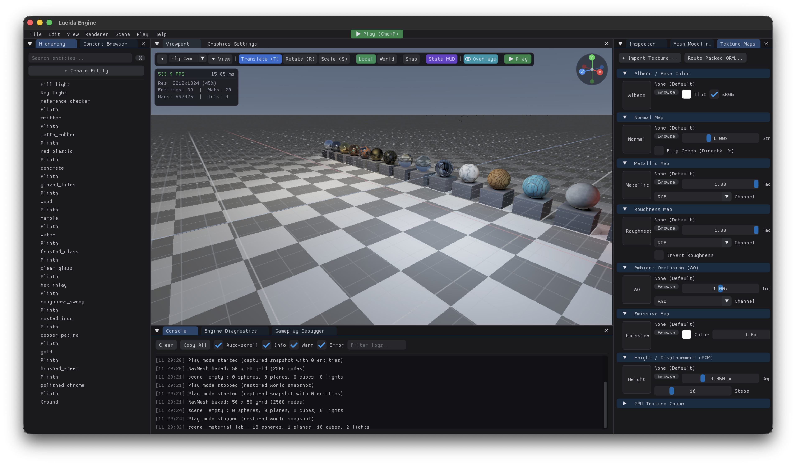

<p align="center">
  
</p>

<p align="center">
  <em>lucida</em> - the brightest star in a constellation.
</p>

<p align="center">
  <a href="LICENSE"></a>
  
  
  
  <a href="https://github.com/BlackLineInteractive/Lucida/actions"></a>
</p>

<p align="center">
  <a href="https://discord.gg/uq2TxADhW"></a>
  <a href="https://t.me/blacklineinteractive"></a>
  <a href="https://youtube.com/@blacklineinteractive"></a>
</p>

---

## Overview

**Lucida** is a next-generation real-time ray tracing game engine engineered from first principles for deterministic Whitted ray tracing, Radiance Cascades Global Illumination, and Data-Oriented Design (DOD).

Built to deliver breathtaking visual fidelity, real-time procedural materials, active physical ragdolls, and hardware-accelerated temporal upscaling without relying on expensive dedicated RT cores.

---

## Showcase

<p align="center">
  
</p>

<p align="center">
  
</p>

<p align="center">
  
</p>

<p align="center">
  
</p>

---

## Performance

Tested on MacBook Pro 16" 2019 (Intel i9-9880H, AMD Radeon Pro 5500M 8 GB - compute-only, no RT hardware):

| Scene | Resolution | Pipeline | Frame rate |
| --- | --- | --- | --- |
| Sponza (~5.7 M triangles) | 1080x720 | Full RT | 15-30 fps |
| Demo Scene (primitives, water, fog) | 1920x1080 | Full RT | 60-110 fps |

Tracing is deterministic Whitted-style with analytic soft shadows and AO. No stochastic noise, no accumulation ghosting, and no temporal blur.

---

## Build

Dependencies are fetched by CMake at configure time (`glm`, `bvh v2`, `Dear ImGui`, `ImGuiFileDialog`, `stb`, `Jolt`, `EnTT`). System `SDL2` and `assimp` are used when present.

```bash
cmake -B build
cmake --build build -j
./build/lucida_sandbox
```

### Platforms

| Platform | Architecture | Renderer | Status |
| --- | --- | --- | --- |
| macOS 13+ | x86_64 / arm64 | Metal + MetalFX | Complete |
| macOS 13+ | Universal | Metal + MetalFX | `LUCIDA_MACOS_UNIVERSAL=ON` |
| Linux (Ubuntu/Debian) | x86_64 / arm64 | OpenGL 4.3 Compute | In progress |
| Windows 10+ | x86_64 / arm64 | Vulkan Compute | In progress |

```bash
# Ubuntu / Debian
sudo apt install build-essential cmake ninja-build libsdl2-dev libassimp-dev
cmake -B build -G Ninja && cmake --build build -j

# Windows (MSVC x64)
cmake -B build -G "Visual Studio 17 2022" -A x64
cmake --build build --config RelWithDebInfo
```

---

## Controls & Shortcuts

| Keys / Mouse | Action |
| --- | --- |
| RMB + Mouse | Fly camera look-around (cursor captured) |
| RMB + W A S D | Fly camera movement in 3D space |
| RMB + Q / E | Fly camera down / up |
| Shift + MMB | Pan camera in viewport (Blender style) |
| MMB Drag | Orbit camera around selected entity |
| 3D Orientation Gizmo | Drag top-right sphere to orbit or click axes for orthographic views |
| RMB + Shift | Camera sprint fly mode (3.0x speed) |
| RMB + Scroll | Dynamically adjust camera fly speed |
| F | Frame and focus camera on selection |
| 1 / 2 / 3 (or T / R / S) | Switch Gizmo mode (Translate / Rotate / Scale) |
| Tab | Toggle Object Mode / Mesh Edit Mode |
| Cmd+Z (Ctrl+Z) | Global Undo (Transforms, Materials, Hierarchy, Mesh edits) |
| Cmd+Shift+Z / Cmd+Y | Global Redo |
| Cmd+D (Ctrl+D) | Duplicate selection |
| Delete / Backspace | Delete selection (undoable) |
| Cmd+P (Ctrl+P) | Play / Stop simulation with state restoration |
| F11 | Toggle Fullscreen |

---

## Core Engine Architecture

- **Deterministic Compute Ray Tracer**: Metal compute pipeline with analytic soft shadows, directional sun, screen-space / ray-traced AO, trochoidal water simulation, and volumetric fog.
- **Hardware Upscaling**: Sub-pixel Halton jittering with per-instance Motion Vectors and Apple MetalFX Temporal AA.
- **Blender-Style Mesh Editor**: Vertex, Edge, and Face level modeling with Extrude, Inset, Subdivide, Normal recalculation, and UV projection.
- **Jolt Physics Integration**: Rigid bodies (Dynamic, Static, Kinematic), character virtual controllers, raycast queries, and collision shapes.
- **Play Mode State Snapshots**: Non-destructive ECS snapshots restoring transform trees and velocities on simulation exit.
- **Modular Editor UI**: Split architecture (`EditorViewport`, `EditorInspector`, `EditorHierarchy`, `EditorConsole`, `EditorTextureBrowser`, `EditorMeshModeling`) under 600 lines per module.
- **PBR Material System**: Albedo, Roughness, Metallic, Normal Maps, Emission, and Index of Refraction presets with GPU cache management.

---

## Directory Layout

```
Lucida/
├── cmake/             Dependency configuration
├── engine/
│   ├── core/          Math, ECS (EnTT), memory, events, logging
│   ├── runtime/       Fixed-step loop, World, gameplay systems, particles
│   ├── render/        Camera, mesh data, IRenderBackend interface
│   ├── resource/      Model loader, mesh builder, textures, terrain, prefabs
│   ├── physics/       IPhysicsBackend interface
│   ├── audio/         Audio system and components
│   ├── animation/     Skeletal animation and skinning
│   └── input/         Action-based HID abstraction
├── backends/
│   ├── render_metal/  Metal compute ray tracer and MetalFX
│   ├── platform_sdl2/ Window, input, surface host
│   └── physics_jolt/  Jolt physics backend
├── framework/         Editor UI modules, camera controller, gizmos, theme
└── apps/sandbox/      Main engine sandbox and project loader
```

---

## Reference Foundations

Engine implementation follows core principles from primary literature:

- Gregory, *Game Engine Architecture* (3rd ed., 2018) - Layering model and subsystem design.
- Nystrom, *Game Programming Patterns* (2014) - Command, Observer, Service Locator, Component patterns.
- Fabian, *Data-Oriented Design* (2018) - Structure of Arrays and cache-coherent ECS.
- Akenine-Moeller et al., *Real-Time Rendering* (4th ed., 2018) - Two-level BVH, Radiance Cascades, PBR derivation.
- Pharr et al., *Physically Based Rendering* (4th ed., 2023) - Deterministic transport correctness.

---

## Licence

Lucida Engine is free software under the **GNU General Public License v3.0 or later** -
see [LICENSE](LICENSE). You may use, study, modify and redistribute it; derived works
that you distribute must carry the same freedoms.

Every dependency is permissively licensed (MIT, BSD-3, Zlib) and fetched at configure
time rather than vendored. The full list, with licences and GPL compatibility notes, is
in [THIRD-PARTY.md](THIRD-PARTY.md).

```
Copyright (C) 2026 BlackLine Interactive
```

---

## Follow the work

Development notes, builds and breakdowns:

<p align="left">
  <a href="https://t.me/blacklineinteractive"></a>
  <a href="https://youtube.com/@blacklineinteractive"></a>
  <a href="https://discord.gg/uq2TxADhW"></a>
</p>

Issues and pull requests are welcome. If you are opening a pull request, read
[docs/ARCHITECTURE.md](docs/ARCHITECTURE.md) first - the dependency rules there are
enforced by CMake, and a change that breaks them will not link.
